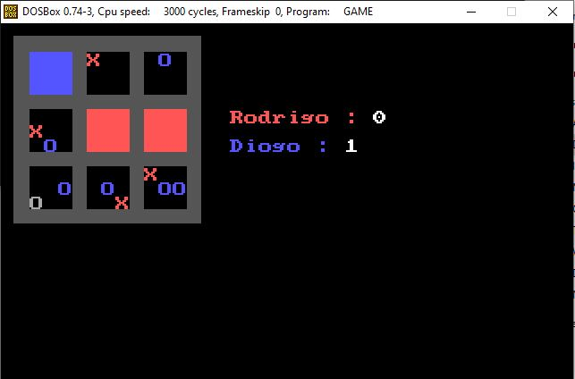
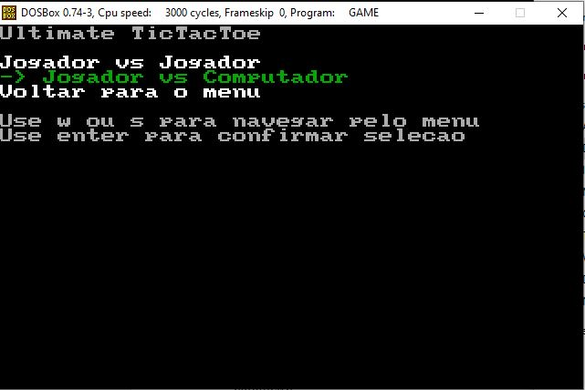
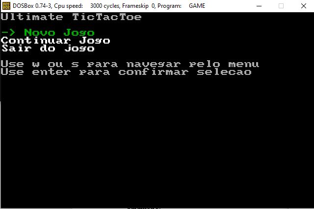

# Ultimate Tic-Tac-Toe em x8086 Assembly

## Descrição

Este é um projeto desenvolvido como trabalho da disciplina Tecnologia e Arquitetura de Computadores na Universidade ISEC. O objetivo do trabalho era criar o jogo "Ultimate Tic-Tac-Toe" utilizando a linguagem assembly x8086.

O Ultimate Tic-Tac-Toe é uma versão do clássico jogo da velha, onde vários tabuleiros menores são agrupados em um tabuleiro maior. O jogo possui vários menus, como tela de título, seleção de modo e uma tela para mostrar o tabuleiro. Além disso, o jogo permite salvar, carregar e continuar jogos salvos, bem como pausar o jogo. Os menus também possuem um sistema de navegação usando as setas do teclado.

## Imagens

Aqui estão algumas capturas de tela do jogo:

### Jogo em Andamento

### Seleção de Modo

### Tela de Título

## Tarefas ❌✅

✅ - Apresentação dos tabuleiros no ecrã (0,1 val)

✅ - Leitura e apresentação do nome do jogador em cada jogada (0,2 val)

✅  - Navegação limitada nas células dos tabuleiros que permitem
assinalar a jogada de cada jogador (X ou O). Bloquear o
mini-tabuleiro quando não fizer sentido mais jogadas no mesmo;(0,5 val)

✅ - Identificação correta quando um dos jogadores ganha um
mini-tabuleiro ou existe um empate no mini-tabuleiro (1,2 val)

✅ - Mostrar corretamente no tabuleiro principal o resultado de cada
vitória dos mini-tabuleiros bem como alteração da cor de fundo no
correspondente mini-tabuleiro. (1,2 val)

✅ -Identificação do vencedor do jogo ou de empate final. (0,8 Val)

### Funçionalidades Extra

✅ Restrição na escolha do mini-tabuleiro (0,6 val)
A escolha do mini-tabuleiro em que se joga não é livre, sendo determinada pela
jogada anterior do adversário. A posição escolhida pelo adversário identifica o
mini-tabuleiro onde deve ser continuado o jogo. 

✅ Poder Pausar o Jogo (0,8 val)

✅ Jogo entre um humano e um jogador automático  (0,6 val)
